##### [<-- Back To Main](../README.md)

# Customer Graphical Human Interface

## Landing Page
This will be the first page visitors see when they arrive to the website.

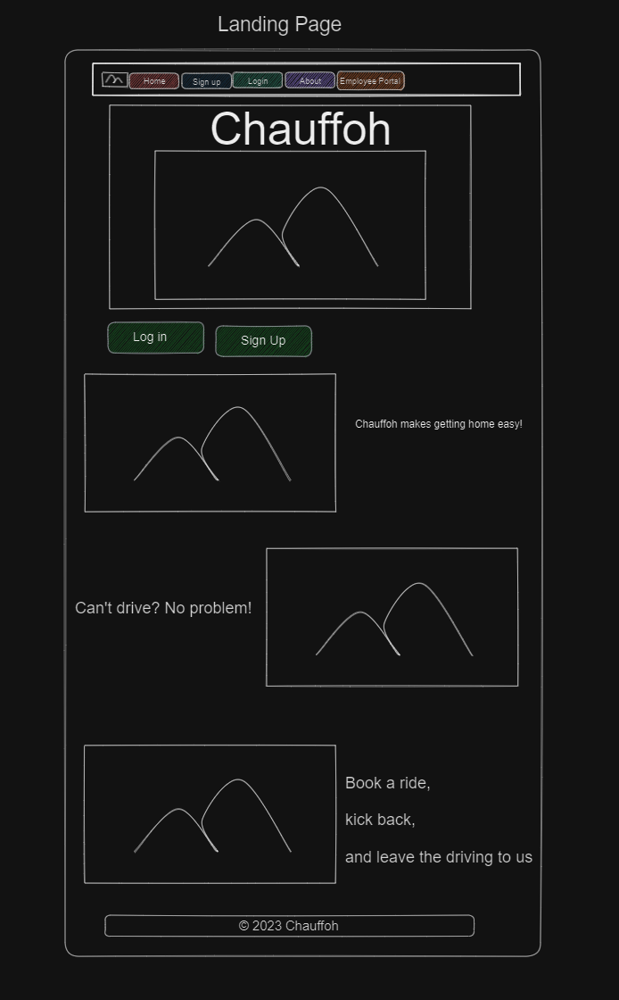

## About Page
Contains a description of Chauffoh and links to our developers' social media.

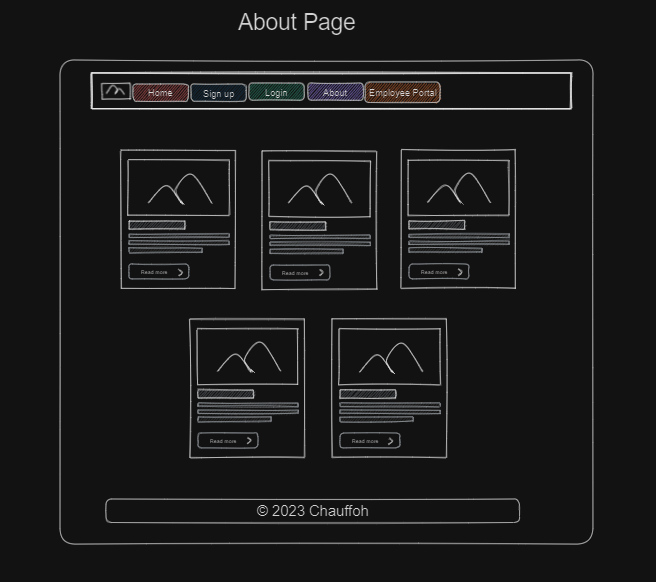

## Login Page
Contains fields for an already signed up user to enter their username and password. There is also a sign-up link if a user is not already registered with Chauffoh

## User Signup
Contains fields for a user to enter sign up information i.e. first name, last name, email, username, and password.

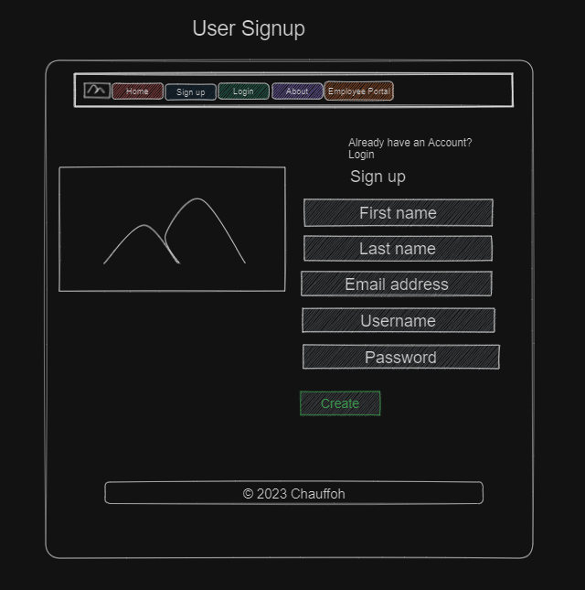

## User Dashboard Page
Contains a page for logged in users to view current ride status, a side bar containing ride history, account info, and a request a ride button. If the user current ride status is "Requested", the user have an option to cancel the ride. Current ride cannot be cancelled when ride status is "In Progress".

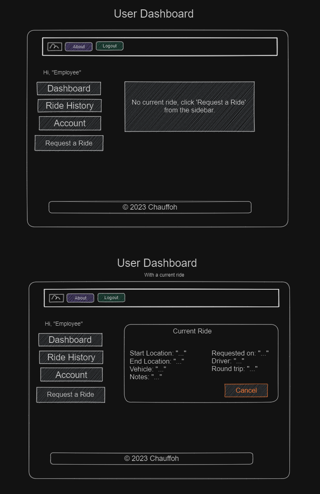

## Request a Ride Page
This page gives the user the ability to request a ride. If user already have a current ride, the user will be unable to request a ride. The user must cancel or complete the ride before requesting a new ride.

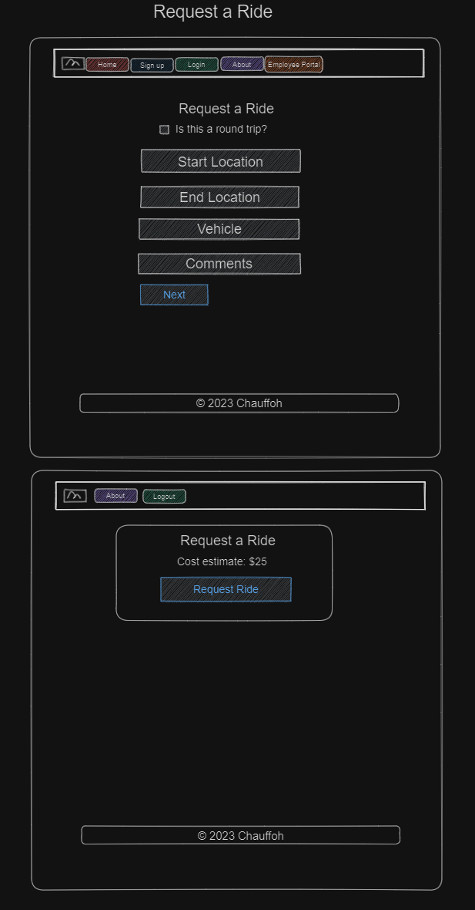

## Ride History Page
Contains the ride history of the user.

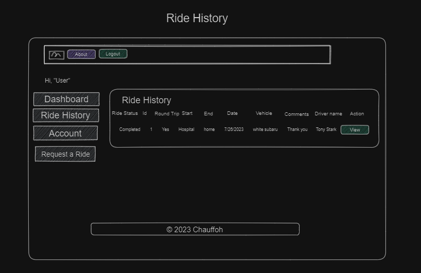

## Ride Information Page
Contains the ride information of a specific ride. The information provided is the ride status, ride id, if the ride is a round trip, starting location, ending location, date requested, the vehicle description, comments, and driver's name.

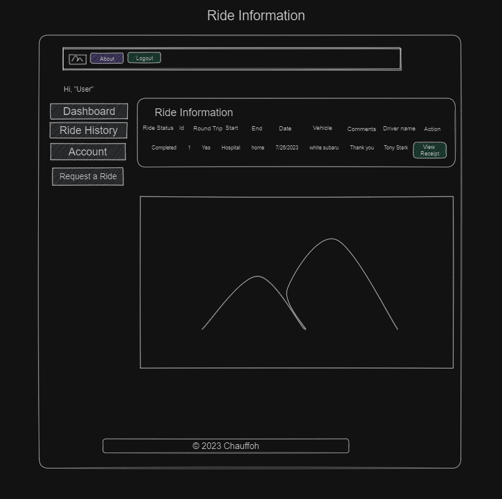

## Final Receipt Page
Contains a final receipt for the user/customer to view.

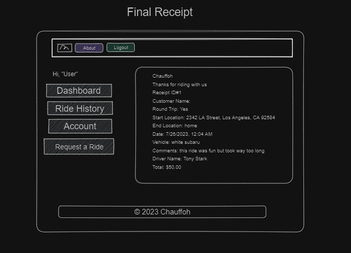

# Employee Graphical Human Interface

## Employee Portal Page
Contains a field for an employee to access the Employee sign-up and sign-in page with a special code provided by Chauffoh.

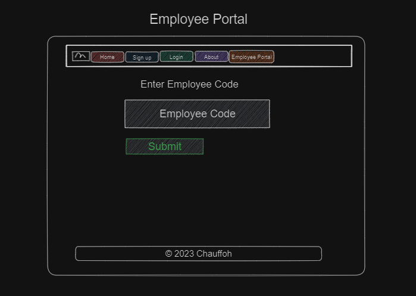

## Employee Signup Page
After a current employee or new employee enters the specially provided code into the field on the employee portal page; the employee is able to enter sign up information i.e. first name, last name, email, username, and password. There also contains a link for an already signed up user to login with their username and password.

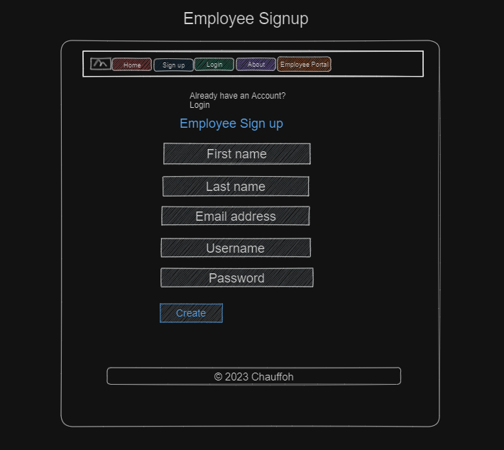

## Employee Dashboard
Contains a page for logged in employees to view in progress rides, open rides, and completed rides. An employee is also able to view a list of current customers and employees.

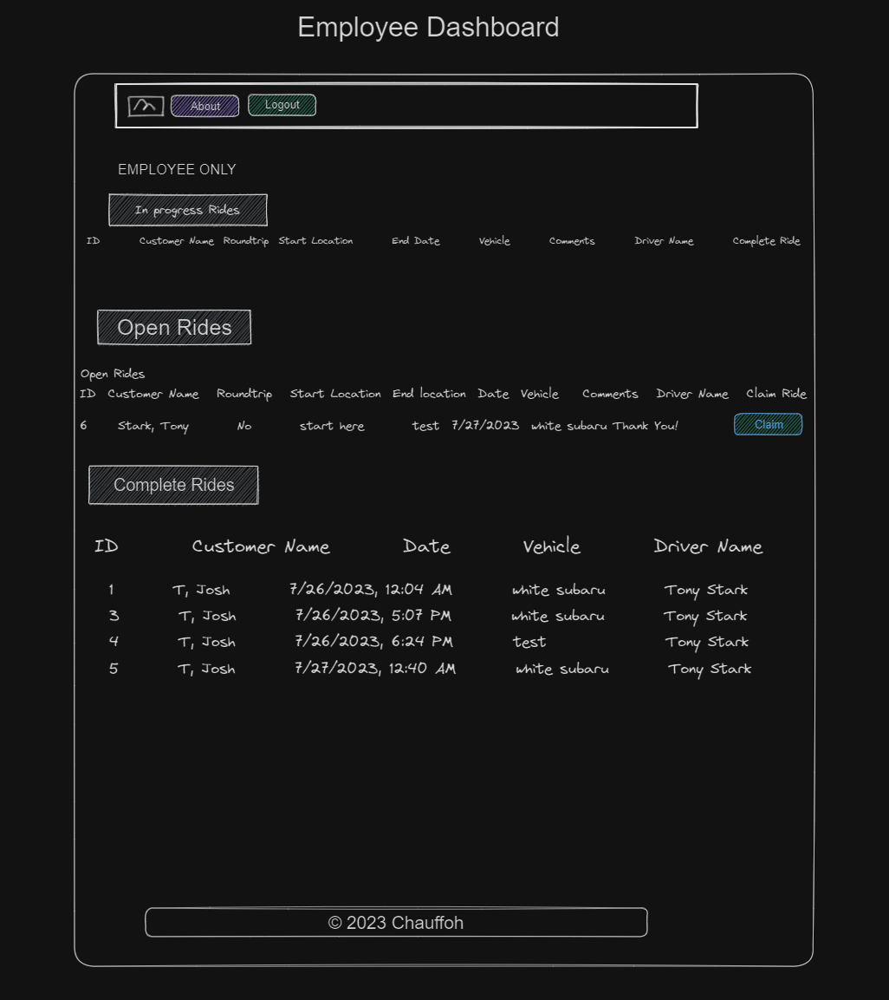

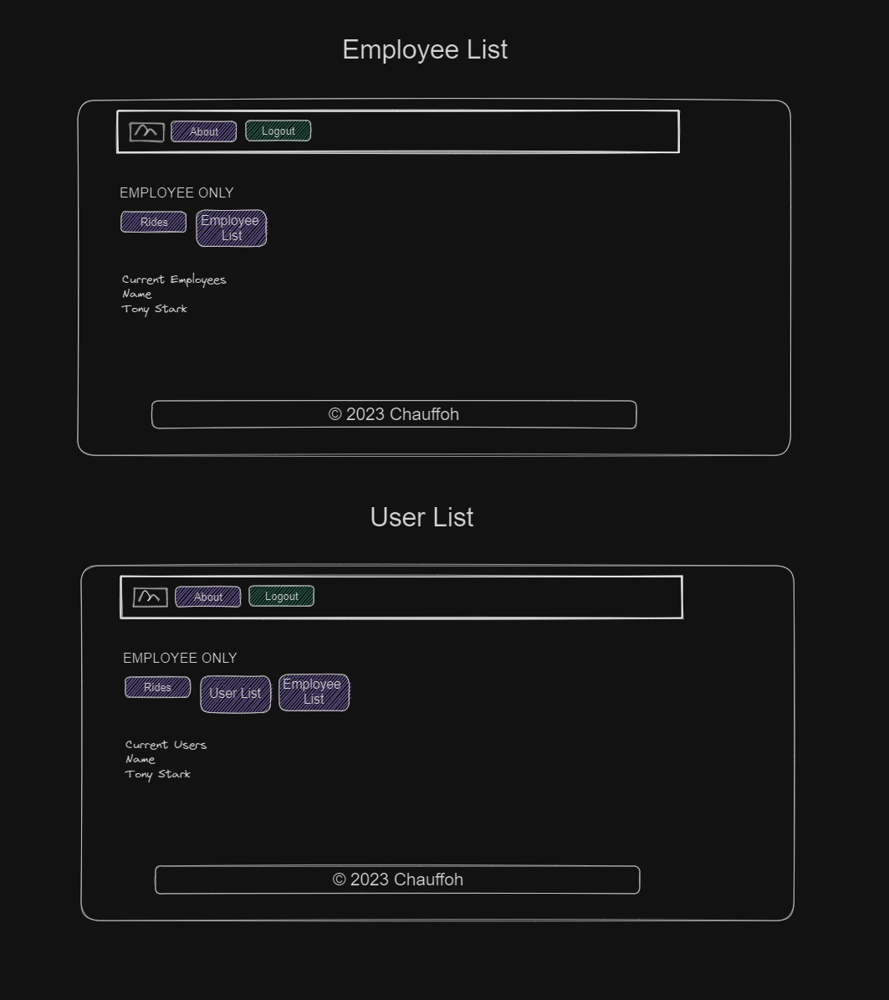

# Employee and Customer Graphical Human Interface

## Account Details Page
Contains a page for account details. A logged in user and employee is able to view and edit their own account information.

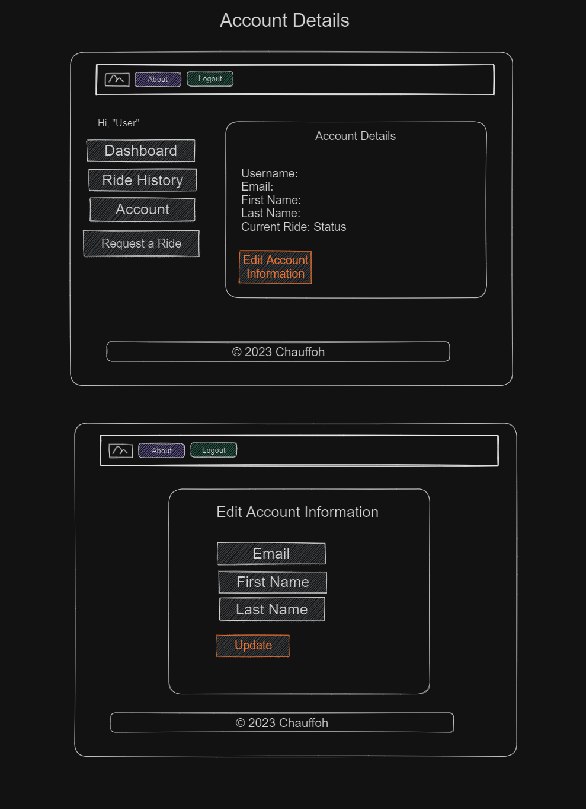
